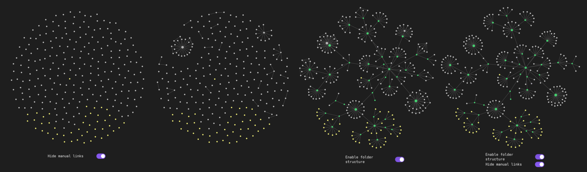

# Folder Graph View 

#### Let your folder structure be your view graph view!

> This is an [Obsidian](https://obsidian.md) plugin 

This plugin, once enabled, will modify your existing obsidian graph view to add named nodes for the parent folders of every node and links between them creating a tree structure.

### Important settings

`Existing files only` should be turned **on**, otherwise, inexistent files (typically broken links) will not be attached to file containing the link, but to the root folder (or will float around if `hide root folder node` is disabled). This is less of an issue if `hide manual links` is disabled since they will be attached to their original origin.

Enable `Orphans` in the side bar, otherwise, only nodes that would already be displayed in the graph without the plugin will be in the folder tree.

`Attachements` **can** be enabled, however if they are stored in a standalone folder, it is recommended to enable `hide manual links` to prevent them from beeing attached to both the parent folder and the file in which they are linked from.

It is also possible to only hide certain file types (typically images) by enabling `Hiden Nodes by strings` and adding one or more file extensions separated by spaces. 

### Manual installation

-  Download the latest release from [repo releases tab](https://github.com/codaloc/FolderGraph/releases),
-   Extract the folder in your vault plugins folder (eg. `/path/to/your/vault/.obsidian/plugin`),

or 

- Clone the repository in your vault plugin folder
- run `npm install` and `npm run build`

 

Then enable the plugin under `Settings`>`Community plugins`>`Installed plugins`

### Credits
Initially based on https://github.com/ratibus11/folders2graph, which is inspired by https://github.com/drPilman/obsidian-graph-nested-tags apparently also inspired by https://github.com/ratibus11/folders2graph? 